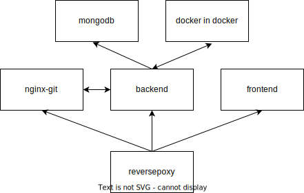

# Underleaf
An online LaTeX editor and compiler.
# Running
```bash
git clone git@github.com:enowars/enowars6-service-underleaf.git
cd service
docker-compose up
```
The service is now available on `*:4242`

# Architecture

- An nginx reverseproxy forwards each request to the correct container, for example a request to `/api`/*` will be forwarded to the backend.
- The frontend serves the static files for rendering the site in a browser
- The nginx-git container allows the cloneing of a project via `http`and is accesible over `/git/`, the reverseproxy manges the authentication required for this by sending `auth_basic`-request to the backend.
- The backend will start a container on the docker in docker container to compile each project, the resulting pdf is then copyed to the backend.
- Mongodb is used as a database for saving the projects and users.